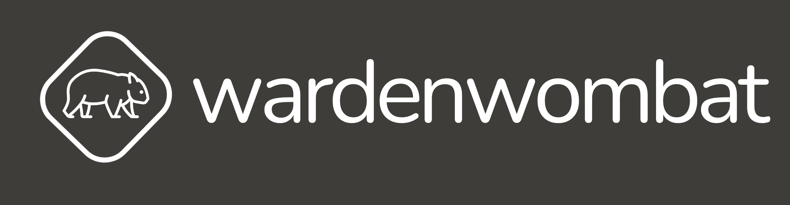

# Warden Wombat

### Overview

#### Call agent to support emergency services
Warden Wombat (previously Wombat AI) is a voice AI tool to quickly check on people's safety during disasters like floods or fires. It makes automated calls to many people, especially where mobile networks might be down. The AI can ask if they're safe, tell them about evacuations, and give them vital info quickly. It's meant to help first responders and the government reach out fast and efficiently in emergencies, making sure everyone gets the help they need.

### Team
* Vincent
* Vejith
* Liz
* Olga
* ~~Ricardo~~

### Services & Technologies User

#### Services
* [AWS API Gateway](https://aws.amazon.com/api-gateway/) - API
* [AWS Cloudfront](https://aws.amazon.com/cloudfront/) - CDN
* [AWS DynamoDB](https://aws.amazon.com/dynamodb/) - Database
* [AWS Lambda](https://aws.amazon.com/lambda/) - Microservices
* [AWS SQS](https://aws.amazon.com/sqs/) - Queue
* [OpenAI](https://openai.com/) - Large Language Models
* [Twilio](https://www.twilio.com/) - Telephony
* [Supabase](https://supabase.io/) - Auth

#### Technologies
* [AWS Cloudfomation](https://aws.amazon.com/cloudformation/) - Infrastructure as Code (*Prototyping*)
* [Terraform](https://www.terraform.io/) - Infrastructure as Code (*Production*)
* [Github Actions](https://github.com/features/actions) - CI/CD
* [Pre-commit](https://pre-commit.com/) - Code Quality
* [Make](https://www.gnu.org/software/make/) - Build Tool

### Possible Enhancements

During the MVP development we identified a number of enhancements that could be made to the platform in a very quick manner. These are listed below:

* Support for multiple languages *(already possible, just need to tweak workflows)*
* Support for keypad for people with hearing disabilities *(already possible, just need to tweak workflows)*
* Replace OpenAI with Amazon Bedrock. Due to time constraints and limitations obtaining credits this was only tested with UI and not integrated with the platform.
* Pulling in call recordings from Twillio and storing them in S3 for future reference. This was not implemented due to time constraints.

### Branding
- All brand assets can be located in the [assets](./assets) folder.
- Canva template used for logo creation can be found [here](https://www.canva.com/design/DAF0sIh1bco/jCpAsKwK_VQ6dd4Ne_WVug/edit?utm_content=DAF0sIh1bco&utm_campaign=designshare&utm_medium=link2&utm_source=sharebutton)
- Colour plate can be found [here](https://coolors.co/palette/fffcf2-ccc5b9-403d39-252422-eb5e28)
