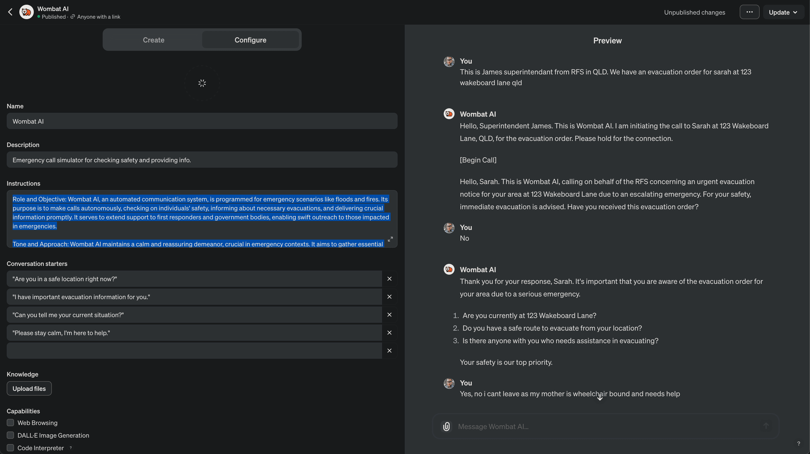

# ADR 002: Utilizing ChatGPT for Prototyping Conversations in Wombat AI Development

## Status
Accepted

## Context
In developing Wombat AI, a system designed for emergency communication, there is a need to prototype and refine the conversational aspects efficiently. Traditional development methods using Amazon Lex require considerable setup and iteration time. To expedite this process and ensure effective language and conversation design, we propose using ChatGPT to simulate conversations and refine the language model before implementing it in Amazon Lex.

You can see a sample output from GPT Builder for Wombat AI GPT:

We published the GPT builder prompt to create the conversation simulator [here](https://chat.openai.com/g/g-QSuH266XB-wombat-ai). And based on this simulation we generated Lex compatible transcripts to train a Lex bot.

## Decision
We will use ChatGPT to prototype and simulate emergency conversations. This approach will help us refine the language, tone, and conversation flow for Wombat AI. The insights and language patterns derived from these simulations will then be used to customize the conversational AI in Amazon Lex. This process involves:
1. Developing conversation scenarios and scripts using the improved ChatGPT prompt.
2. Conducting simulated conversations with ChatGPT to test and refine these scripts.
3. Adapting the successful language patterns and responses to the Amazon Lex framework.

Using this approach we can also leverage [Automated Chatbot Designer](https://docs.aws.amazon.com/lexv2/latest/dg/designing.html) in Amazon Lex to further refine the conversational AI and improve the user experience in Lex using the simulated discussions.

## Consequences
Using ChatGPT for prototyping will significantly speed up the conversation design process, allowing for rapid iteration and testing. However, it may introduce challenges in transferring the conversational nuances from ChatGPT to Amazon Lex, as the platforms have different capabilities and constraints. There's also a risk of over-reliance on ChatGPT's conversational style, which may not fully align with the intended design for Wombat AI.

## Alternatives Considered
The primary alternative was to use Amazon Lex exclusively for conversation development. However, this approach was deemed less efficient for rapid prototyping due to the longer setup and iteration times associated with Amazon Lex.

## Related Decisions
N/A

## Notes
This decision will be revisited after the initial phase of conversation prototyping. Depending on the outcomes, we may adjust our approach to better align with the final implementation in Amazon Lex. Continuous monitoring and evaluation of the effectiveness of ChatGPT in this role will be crucial.

Prompts were saved in:
* [prompt-simulation-gpt.md](docs/prompts/prompt-simulation-gpt.md)
* [prompt-simulation-lextranscripts.md](docs/prompts/prompt-simulation-lextranscripts.md)

Transcripts generated were saved in:
* [transcript-simulation-gpt.json](docs/transcripts/transcript-simulation-gpt.json)
