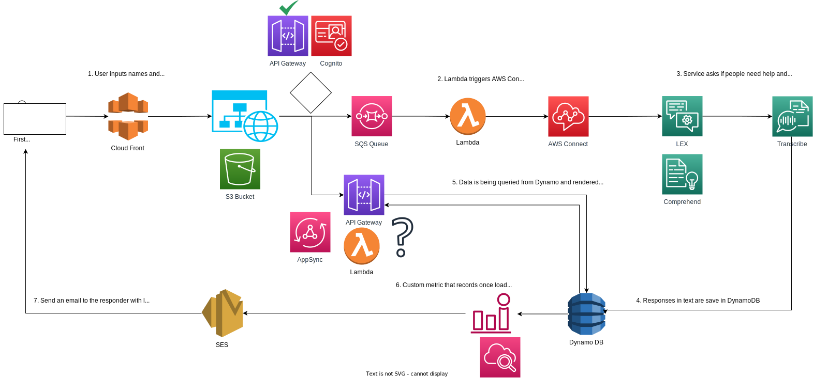

# ADR 004: [Short Title of Solved Problem]

## Status
Approved

## Context
Triggering an AWS Simple Queue Service (SQS) from a frontend website hosted on Amazon S3 via CloudFront. In this scenario, there are the following options:

1. Set up an AWS API Gateway that serves as an intermediary between your frontend website and the SQS queue.
2. Amazon Cognito is an identity management service that can be integrated with the frontend website to manage user identities and authentication.
3. API Gateway with Cognito

## Decision
As a lightweight MVP solution: API Gateway, with CORS enabled blocking traffic from other origins except for CLoud Front. Later on we should look into adding Cognito for additional security. Along with authentication and authorization on the frontend side.

## Consequences
Plus: Easy to implement, fast, scalable.
Cons: Not as secure as option with Cognito

## Alternatives Considered
All 3 options above

## Related Decisions
Slack [here](https://aihackmelb.slack.com/archives/C066QP8GLRF/p1700431126197149)

## Notes
