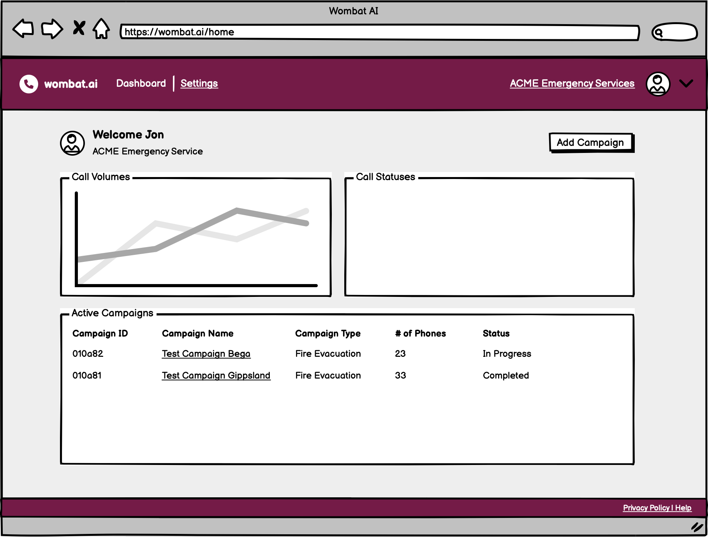
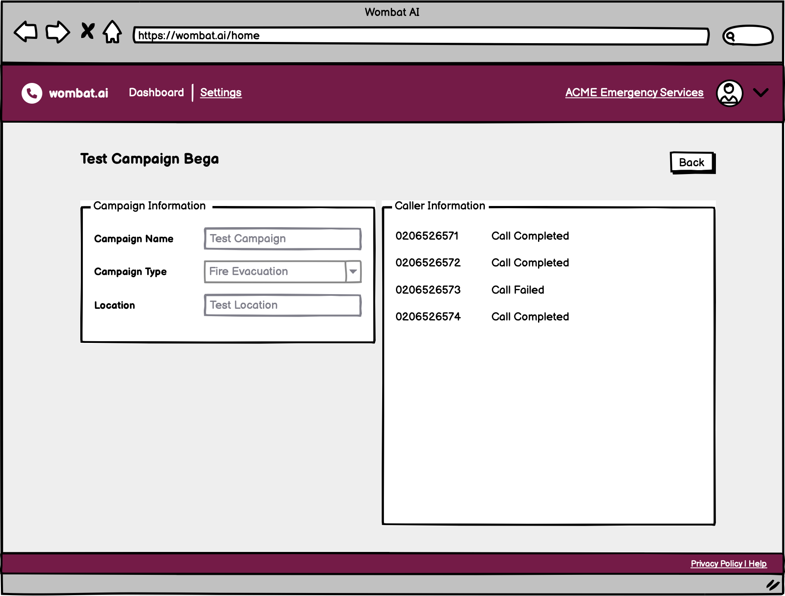
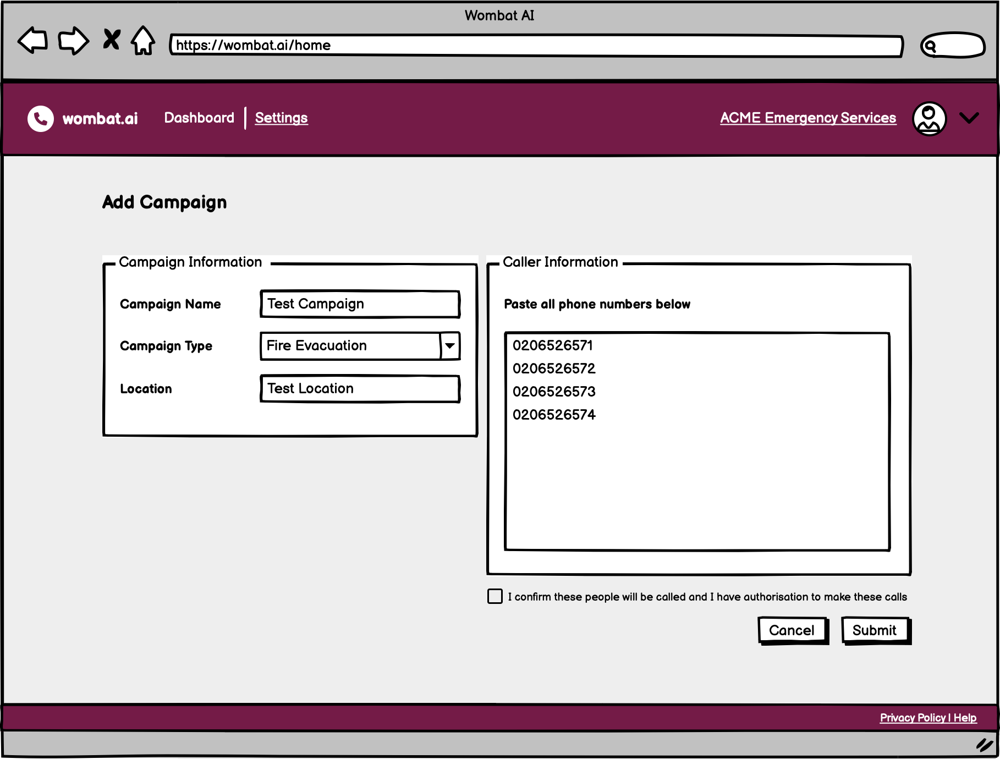

# ADR 005: Frontend

## Status
Accepted

## Context
Decide on the website layout, design, frameworks and displayed data.

## Decision

We will be using existing components where possible vs building from stratch.
Frameworks: NextJS, Typescript, Material UI.

Layout will consist of 2 pages: dashboard and submission page which will become a progress page once the data is submitted. 

1|2|3
-|-|-
 |  | 

## Consequences
Risk: Multiple pages and extended datapoints may take a longer time vs one page

## Alternatives Considered

## Related Decisions

## Notes

