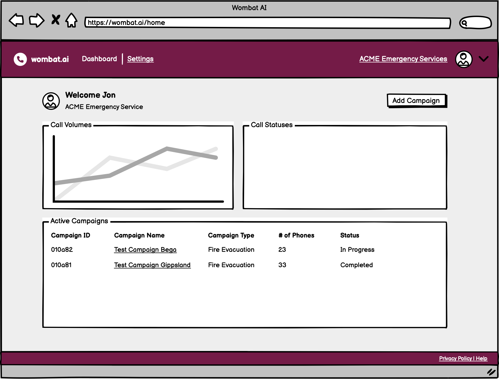
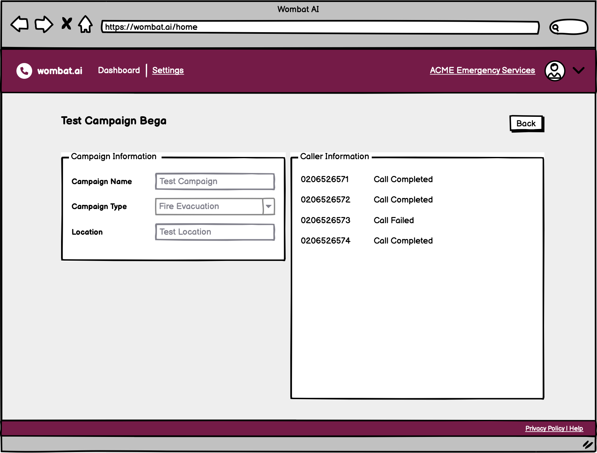
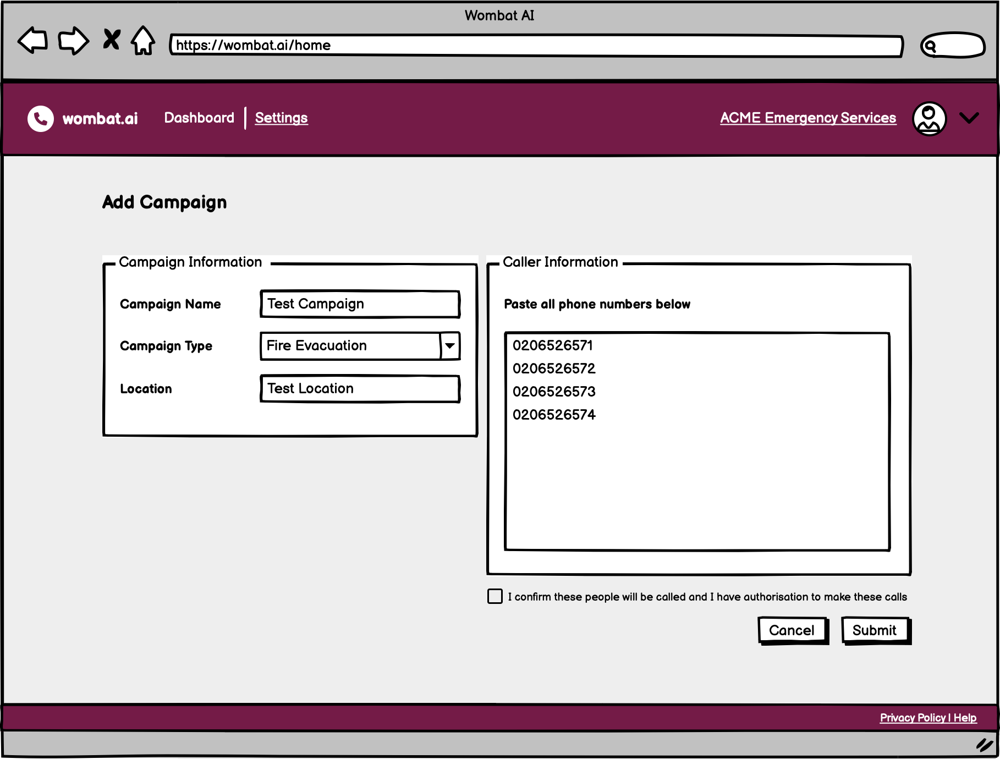

# ADR 005: Frontend Application Layout and Features

## Status
Accepted

## Context
Decide on the website layout, design, frameworks and displayed data. This will help inform design of backend services, data models and application design.

## Decision

1. We will be using existing components where possible vs building from scratch in order to speed up development (NextJS, Typescript, Material UI).
2. We will be using a multi-page layout vs a single page layout in order to simplify development and reduce complexity.
3. Layout will consist of 2 pages: dashboard and submission page which will become a progress page once the data is submitted.
4. We will continue to use `AWS Lambda` and `AWS API Gateway` for our backend services, this should simplify the development and testing of the frontend application.

1|2|3
-|-|-
 |  | 

## Consequences
Risks have been identified with multiple pages and extended complex datapoints. We risk over complicating the MVP.

## Alternatives Considered
n/a

## Related Decisions
See assets folder for wireframes.

